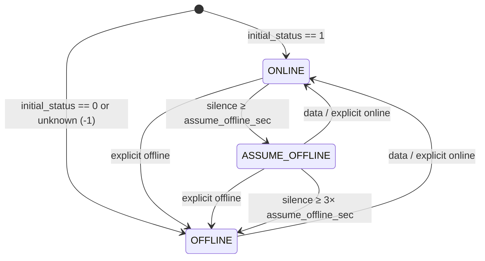

# Device status and sensor reset

How the integration decides whether a device is online, and when sensors fall
back to their defaults. Source: `devices/status_tracker.py`,
`devices/status_coordinator.py`, `devices/data_holder.py`, `entities/__init__.py`,
`sensor.py`.

## Why MQTT and not polling

Sensors are driven by the MQTT messages the cloud pushes to us, and that same
stream is what keeps a device `ONLINE`. HTTP polling only comes into play when a
device goes quiet and the integration needs to find out why. That is what the
`/device/list` poll and the per-device `quota_all` nudge below are for.

So only MQTT messages mark a device online. Data fetched over HTTP does not,
because the quota endpoint keeps returning the last known values even for a
device that went offline days ago.

## The three statuses

| Status | Meaning | `is_online` | `is_offline` |
|---|---|---|---|
| `ONLINE` | Recent data from the cloud | `True` | `False` |
| `ASSUME_OFFLINE` | Silent for a while, but nothing confirmed it offline | `False` | `False` |
| `OFFLINE` | Cloud said offline, or silence passed the hard threshold | `False` | `True` |

`ASSUME_OFFLINE` is neither online nor confirmed offline. Sensors keep their last
value there, see [Sensor reset](#sensor-reset).

## Signals

`StatusTracker` accepts two kinds of signal.

`on_data_received()` is the implicit one: an MQTT message carrying real params
arrived. Only auto messages count (`PreparedData.is_auto`), so data pulled from
the API never marks a device online. The call refreshes the last-data timestamp
and clears the explicit-offline flag.

`on_explicit_status(online)` is authoritative, the cloud actually told us. It
comes from the MQTT status topic, the `online` field on a `latestQuotas` reply,
or the global `/device/list` poll. An explicit online behaves like a data
message. An explicit offline sets a sticky flag, and only the next data message
clears it.

Everything reaches the tracker through `EcoflowDataHolder.__accept_prepared_data`,
so that method is where to look when a signal appears to go missing.

### Which signals exist per API

The two account types subscribe to different topics, so the same machinery
behaves differently on each.

| Signal | Private API (`BaseInternalDevice`) | Public API (`BaseDevice`) |
|---|---|---|
| Implicit online (data) | `/app/device/property/{sn}` | `/open/{user}/{sn}/quota` |
| MQTT status topic | none, there is no such topic | `/open/{user}/{sn}/status` |
| `latestQuotas` reply `online` | yes, on the `get_reply` topic | n/a, `get_topic` is `None` |
| `/device/list` poll | never, the coordinator only drives public clients | yes |
| `quota_all` nudge | MQTT `get`, and the reply carries explicit status | HTTP, refreshes values but never marks online |

That leaves a private-API device with a single route to a clarified status: the
per-device quota nudge. Public devices get the status topic and the global poll
instead, and their nudge only refreshes values. Which is why almost every
private device uses `QuotaStatusSensorEntity` with `poll_when_silent=True`,
while most public ones use the plain `StatusSensorEntity`.

## Status computation

Computed on read from the explicit-offline flag, the age of the last data, and
`assume_offline_sec` (default 300s):

- explicit-offline flag set → `OFFLINE`
- else age < `assume_offline_sec` → `ONLINE`
- else age < 3× (`900s`) → `ASSUME_OFFLINE`
- else → `OFFLINE`

`OFFLINE` therefore happens either by an explicit signal or by silence past 3×
the threshold. `ASSUME_OFFLINE` is only ever reached through silence.

At construction the tracker seeds itself from `EcoflowDeviceInfo.status`. A `1`
replays as an explicit online, any other value ≥ 0 as an explicit offline. The
default `-1` seeds nothing, which leaves the tracker with no data and computes
to `OFFLINE` until the first message arrives.

## Sensor reset

On each coordinator update an entity decides what to do
(`EcoFlowDictEntity._handle_coordinator_update`):

| Condition | Effect |
|---|---|
| Fresh data arrived | Update to new value |
| No new data, not `OFFLINE` (including `ASSUME_OFFLINE`) | Keep last value |
| `OFFLINE` (`is_offline`) | Reset to default, if one is defined |

Only `BaseSensorEntity` sensors with a non-`None` `_attr_default_value` reset,
for example watts, amps and volts back to 0, or remaining time to 0. Sensors
without a default just stop updating, and so do non-sensor entities like
switches, selects and numbers. Holding the last value through `ASSUME_OFFLINE`
is what keeps a short MQTT hiccup from flickering watts down to 0 and straight
back up again.

## Active polling when silent

While a device sits in `ASSUME_OFFLINE`, two mechanisms try to resolve it.

`DeviceStatusCoordinator` is global and runs every `min(assume_offline_sec)`
across registered devices. If at least one device wants a poll it calls
`/device/list` on every registered public-API client and feeds the results back
as explicit status, matched by SN. Otherwise the cycle is skipped, and with no
public-API client registered it does nothing at all. Note that the cadence is
the minimum across all registered devices, private ones included, even though
only public clients ever get polled.

The per-device quota nudge is fired by status sensors with `poll_when_silent` on
entry to `ASSUME_OFFLINE`, throttled by `assume_offline_sec`. On the private API
it is an MQTT `get` whose `latestQuotas` reply carries an explicit online or
offline value. On the public API it is an HTTP call that only refreshes values.
The nudge count shows up as the `quota_requests` attribute.

## Status sensor

A diagnostic sensor reporting `online`, `assume_offline` or `offline`. The
middle label is hidden by default, so the sensor holds its previous value until
something really changes or the 3× timeout flips it to `offline`. Verbose status
mode makes the intermediate label visible and adds the `status_request_count`
and `data_update_count` counters.

The same update tick also looks after the MQTT connection. If the client is
disconnected it schedules a background reconnect, throttled by a 60s cooldown,
and publishes the running count as `reconnects`.

Attributes:

- `SN`
- `data_last_update`, age of the last data message. Rendered as `< N sec` while
  within `assume_offline_sec`, otherwise as the raw timestamp.
- `status_last_update`, same rendering, for the last explicit status signal. It
  appears once the sensor has published its first state.
- `mqtt_connected`, MQTT connection state, independent of device status
- `reconnects`, MQTT reconnect count
- `quota_requests`, nudge count, only on `poll_when_silent` or scheduled sensors

`QuotaScheduledStatusSensorEntity` also polls `quota_all` on a fixed interval
(3600s by default) regardless of status. Be careful reading anything into that.
On the public API the quota endpoint returns the last known values even for an
offline device, so a poll coming back successfully proves nothing about whether
the device is actually online.

## Configuration

Per device, through the integration's Configure flow:

| Option | Default | Effect |
|---|---|---|
| `assume_offline_sec` | 300 | Silence threshold for `ASSUME_OFFLINE`. 3× this (900s) means `OFFLINE`. |
| `verbose_status_mode` | off | Shows the `assume_offline` label and the extra counters. |
| `reset_sensors_on_offline` | on | While `OFFLINE`, resets sensors that declare a default value to it. Off keeps the last received value. |

The global coordinator takes the lowest `assume_offline_sec` across all devices
as its poll cadence, so lowering it on one device speeds up everyone.
